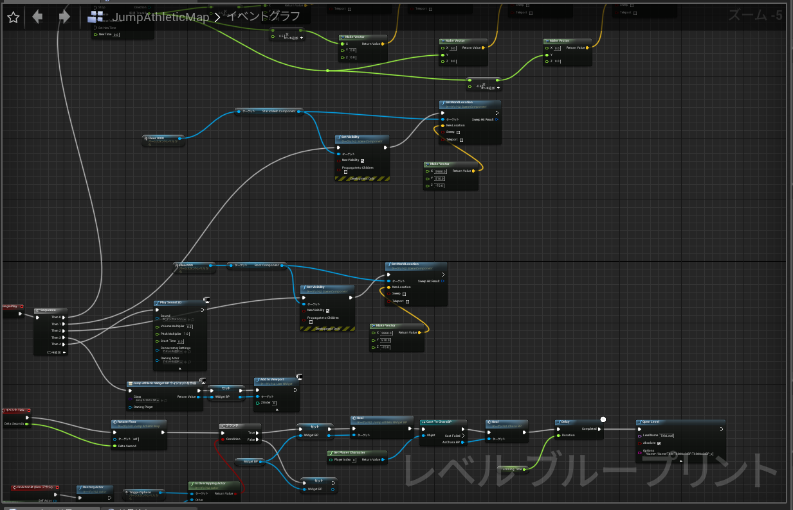

# UnrealEngine

##　Unityとの名称の違い

|Unity|UnrealEngine|役割|
|:-:|:-:|:-|
|Scene|Level|シーン全体の管理|
|GameObject|Actor|ゲーム内に配置されるオブジェクト|
|Hierarchy|Outliner|シーン内のオブジェクトリスト|
|Assets|ContentsBrowser|リソース一覧|
|Animetor|AnimGraph|アニメーション遷移|
|Inspector|Detail|リソースの情報|
|Prefab|BluePrint|オブジェクト設計図|

## 画面の構成

配置などは適宜変更ができる
ただし、Unityとは違い。プレイ中はLevelの中を自由に見ることはできない。Unityで言うSceneViewはプレイを実行することでGameViewに置き換わるようになっている。

## 入力イベント

操作の入力イベントはプロジェクト設定から設定ができる。

## BluePrint

BluePrintには以下の種類がある。  

* **LevelBluePrint**
    Levelを制御する  
    Level上に配置されたStaticMeshのコントロールが可能

* **BluePrintClass**  
**各BluePrintの親クラス**
BluePrintクラスを使うためには動作元の親クラスを設定しないといけない
  * **Actor**
   ワールドに配置またはSpawnできるオブジェクト
  * **Pawn**
  所有可能で、コントローラから入力値を受け取るActor
  * **Charactor**
   歩行、走る、ジャンプなどの能力を含んだPawnの種類
  * **PlayerController**
  プレイヤーが利用するPawnの制御を行うActor
  * **GameMode**
  プレイ中のゲーム、ゲームのルール、スコア採点等のゲームの中身を定義する

* **AnimationBluePrint**
  スケルタルメッシュ(ボーンを持つメッシュ)のアニメーションを制御する

BluePrintの中でノードをつないでプログラムを表現するコンポーネントをイベントグラフという。
      

AnimationBluePrintではこれの他にアニムグラフを使用してアニメーションの遷移ルールを作成していく
    
